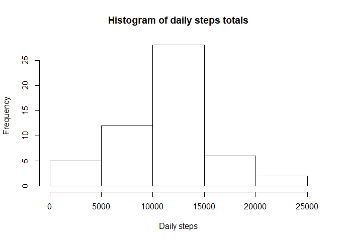
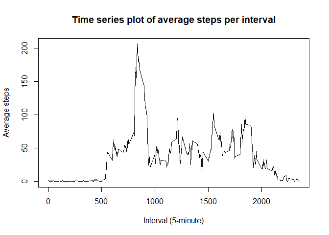
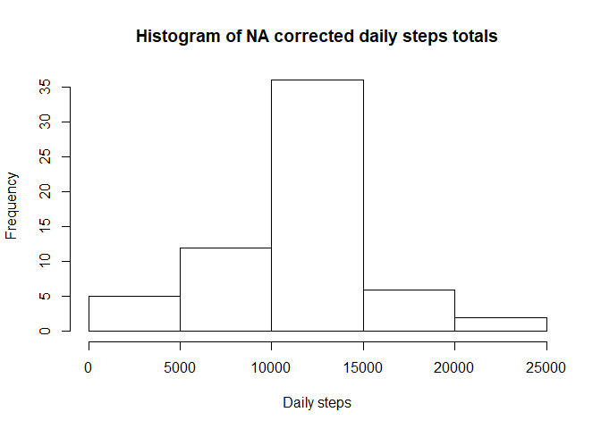
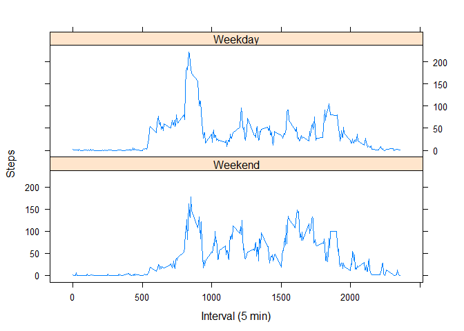

## Loading and preprocessing the data


```r
library(tidyverse)
```

```
## Warning: package 'tidyverse' was built under R version 3.4.3
```

```
## -- Attaching packages ---------------------------------------------------------------------------------------------------------------- tidyverse 1.2.1 --
```

```
## v ggplot2 2.2.1     v purrr   0.2.4
## v tibble  1.4.2     v dplyr   0.7.4
## v tidyr   0.8.0     v stringr 1.3.0
## v readr   1.1.1     v forcats 0.3.0
```

```
## Warning: package 'tibble' was built under R version 3.4.3
```

```
## Warning: package 'tidyr' was built under R version 3.4.3
```

```
## Warning: package 'purrr' was built under R version 3.4.3
```

```
## Warning: package 'dplyr' was built under R version 3.4.3
```

```
## Warning: package 'stringr' was built under R version 3.4.3
```

```
## Warning: package 'forcats' was built under R version 3.4.3
```

```
## -- Conflicts ------------------------------------------------------------------------------------------------------------------- tidyverse_conflicts() --
## x dplyr::filter() masks stats::filter()
## x dplyr::lag()    masks stats::lag()
```

```r
library(timeDate)
```

```
## Warning: package 'timeDate' was built under R version 3.4.3
```

```r
library(lattice)
data <- read.csv("activity.csv")
```


## Mean total number of steps taken per day

```r
options(scipen=999)
ds <- data %>% group_by(date) %>% summarise(daily = sum(steps))
ms <- round(mean(ds$daily, na.rm=TRUE), 1)
md <- round(median(ds$daily, na.rm=TRUE), 1)
hist(ds$daily, main="Histogram of daily steps totals", xlab="Daily steps")
```

<!-- -->

The mean of the daily steps is 10766.2 and the median is 10765.


## What is the average daily activity pattern?

```r
dint <- data %>% group_by(interval) %>% summarise(avg=mean(steps, na.rm=TRUE))
intmax <- dint[which.max(dint$avg),]$interval
plot(dint$interval, dint$avg, type="l", main="Time series plot of average steps per interval", xlab="Interval (5-minute)", ylab="Average steps")
```

<!-- -->

The 5-minute interval which contains the maximum number of steps averaged across all the days is 835.

## Imputing missing values
Missing values will be the interval averaged ones calculated above.

```r
mv <- sum(is.na(data$steps))
cdata <- data.frame(data)
for (i in 1:length(cdata$steps)) {
  if (is.na(cdata$steps[i])) {
    cdata$steps[i] <- dint$avg[which(dint$interval == cdata$interval[i])]
  }
}
cds <- cdata %>% group_by(date) %>% summarise(daily = sum(steps))
cms <- round(mean(cds$daily), 1)
cmd <- round(median(cds$daily), 1)
hist(cds$daily, main="Histogram of NA corrected daily steps totals", xlab="Daily steps")
```

<!-- -->

There are 2304 missing values in the step data. I replaced the missing values with the average number of steps for the specific intervals calculated across all the days.

For this corrected data, the new mean of the daily steps is 10766.2 and the new median is 10766.2.  There is little impact on the mean and median locations by making these changes and the distribution is unchanged.


## Are there differences in activity patterns between weekdays and weekends?

```r
cdata$when <- factor(isWeekend(as.POSIXct(cdata$date)), labels=c("Weekend", "Weekday"), levels=c(TRUE,FALSE))
by_group <- cdata %>% group_by(when, interval)
setint <- summarise(by_group, avg=mean(steps, na.rm=TRUE))
xyplot(avg ~ interval | when, data = setint, layout=c(1,2), type = "l", xlab = "Interval (5 min)", ylab = "Steps")
```

<!-- -->


