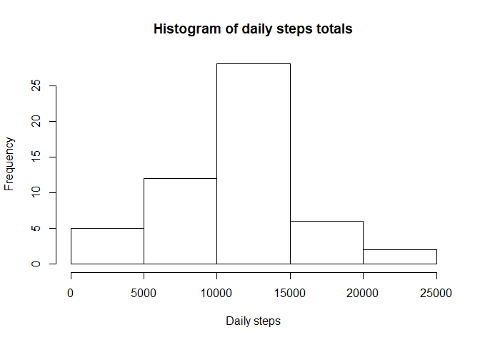
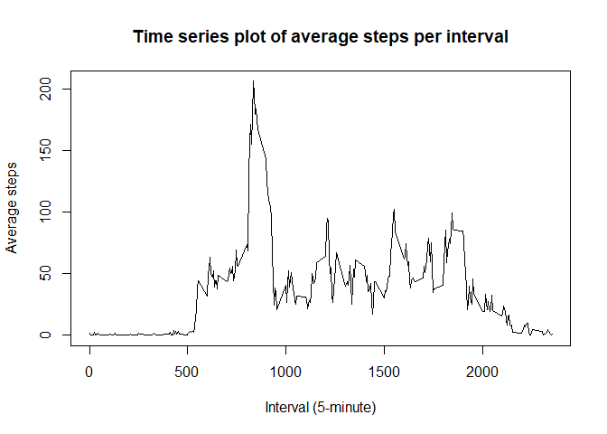

# Reproducible Research: Peer Assessment 1


## Loading and preprocessing the data


```r
library(dplyr)
```

```
## 
## Attaching package: 'dplyr'
```

```
## The following objects are masked from 'package:stats':
## 
##     filter, lag
```

```
## The following objects are masked from 'package:base':
## 
##     intersect, setdiff, setequal, union
```

```r
data <- read.csv("activity.csv")
```


## Mean total number of steps taken per day

```r
options(scipen=999)
ds <- data %>% group_by(date) %>% summarise(daily = sum(steps))
ms <- round(mean(ds$daily, na.rm=TRUE), 0)
md <- round(median(ds$daily, na.rm=TRUE), 0)
hist(ds$daily, main="Histogram of daily steps totals", xlab="Daily steps")
```

<!-- -->

The mean of the daily steps is 10766 and the median is 10765.


## What is the average daily activity pattern?

```r
dint <- data %>% group_by(interval) %>% summarise(avg=mean(steps, na.rm=TRUE))
intmax <- dint[which.max(dint$avg),]$interval
plot(dint$interval, dint$avg, type="l", main="Time series plot of average steps per interval", xlab="Interval (5-minute)", ylab="Average steps")
```

<!-- -->

The 5-minute interval with the contains the maximum number of steps averaged across all the days is 835.

## Imputing missing values


## Are there differences in activity patterns between weekdays and weekends?
